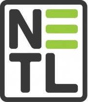

# NGFC-Lib 

Python implementation of high-performance C and Fortran codes with a jupyter notebook framework to model natural-gas fuel cell systems. Includes software tools developed by the Institute for the Design of Advanced Energy Systems (IDAES) and machine learning tools for fuel cell optimization.

UW DIRECT capstone project Spring 2020. Collaborators: PNNL, NETL, and ARPA-E.

   

## Organization
